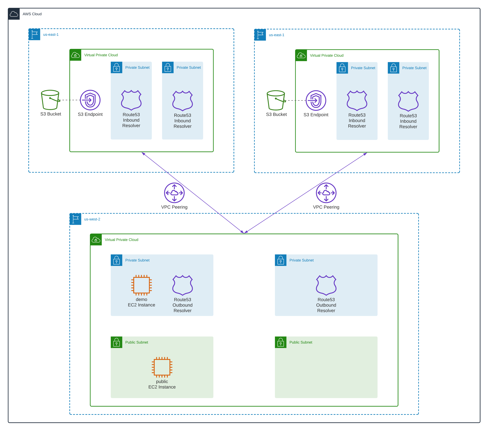
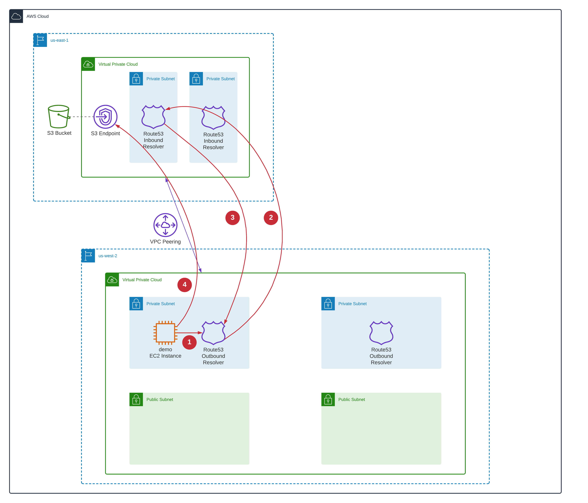

# Automating Access To Multi-Region VPC Endpoints using Terraform

This is a demo repository for the [Automating Access To Multi-Region VPC Endpoints using Route53 Resolver And Terraform](https://hands-on.cloud/automating-access-to-multi-region-vpc-endpoints-using-terraform/) article.

This module sets up the following AWS services:

* VPC
* EC2
* S3
* Route53



VPC Endpoint resolution workflow:



## Deployment

```sh
terraform init
terraform plan
terraform apply -auto-approve
```

## Tier down

```sh
terraform destroy -auto-approve
```
